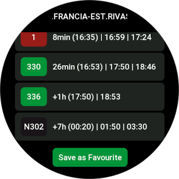
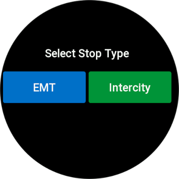

  

<h1 align="center">Madrid Bus for Zepp OS</h1>

  <strong>🚌 Madrid city bus arrival times on your wrist</strong>
   
  <i>Built with ❤️‍🔥 by <a href="https://github.com/dubisdev">@dubisdev</a></i>

  <a href="#">
    🔗 Download Madrid BUS
  </a>
    &nbsp; | &nbsp; Give it a Star ⭐

## Screenshots

  
  
  

  
  
  

## 📄 Privacy Policy

> Madrid Bus does not collect any personal data. All user information is stored in the device and is not shared with third parties.
> Madrid Bus connects to the official CRTM service to retrieve the information about the stops and arrival times.

## ⚖️ License

MIT © David Jiménez 2026

